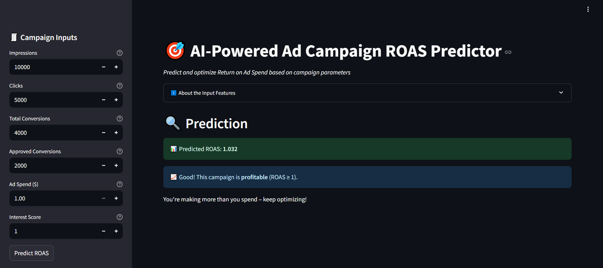

# 🔥 Roast My ROAS

**Predict your Return on Ad Spend (ROAS)... before your marketing campaign sets your budget on fire.**  
This is a fun, interactive app built with [Streamlit](https://streamlit.io) to help marketers and data analysts quickly estimate campaign profitability using machine learning.


## 📸 App Preview



---

## 🤔 What Is ROAS?

> **ROAS (Return on Ad Spend)** is a key metric in advertising that tells you how much revenue you're making for every $1 spent on ads.

For example:
- ROAS of **2.0** → You're earning $2 for every $1 spent = 💰
- ROAS of **0.5** → You're losing money = 🔥

This app uses a trained Random Forest model to predict ROAS based on your campaign's performance metrics (clicks, conversions, spend, etc.) — giving you insight before you blow the budget.

---

## 🚀 Features

- 📈 Predict ROAS from custom input values
- 🎛️ Sidebar inputs with clear tooltips for each metric
- ⚙️ Smart feature engineering (conversion rates, costs per action)
- 🤖 Built on a trained Random Forest Regressor model
- 🧠 Simple interpretation (profitability thresholds with emoji-based feedback)
- 🧾 Built-in expander for users to learn what each input means

---

## 🧪 Try It Out Locally

```bash
git clone https://github.com/Maddy10/roast-my-roas.git
cd roast-my-roas
pip install -r requirements.txt
streamlit run app.py
